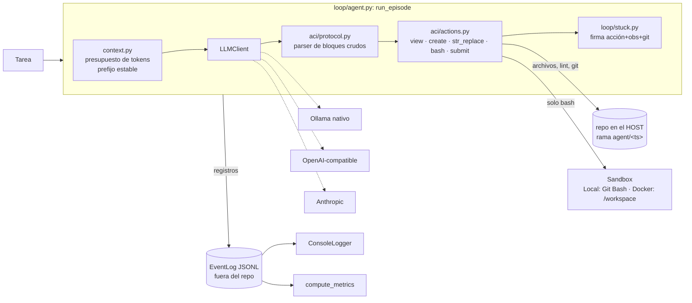

# Mini-SWE-Agent Local

Agente de ingeniería de software minimalista (estilo Mini-SWE-Agent / SWE-agent) pensado para
correr con modelos locales vía Ollama, y con cualquier API cloud detrás de la misma interfaz.
Solo stdlib en runtime.

> Lo desarrollan en conjunto **Claude Code** y **Antigravity**. Las decisiones de arquitectura,
> los dueños de cada módulo y los pedidos entre agentes están en
> [docs/DECISIONES.md](docs/DECISIONES.md).

## Estado

| Fase | Qué | Estado |
|---|---|---|
| 0 | Análisis del núcleo + plan | ✅ |
| 1 | Hardening: paquete modular, ACI validado, sandbox Local/Docker, stuck v2, clientes LLM, benchmark | 🔧 integrado en `fase1/claude-core`, falta el benchmark real y los pedidos abiertos |
| 2 | Repo map con tree-sitter como acción `search` | pendiente |
| 3 | Critic (veredicto sobre diff + tests antes de aceptar submit) | pendiente |
| 4 | Pipeline tipo Agentless para bugs acotados | pendiente |
| 5 | CLI de evaluación + informe honesto con Qwen3 8B | pendiente |

**Todavía no hay números reales con el modelo local.** La tasa de éxito y los tiempos por paso
se miden en la Fase 5; las velocidades de Ollama, con `bench/speed.py` (Fase 1).

## Arquitectura



Decisiones clave (detalle en los ADR):

| Pieza | Decisión | ADR |
|---|---|---|
| Sandbox | **Solo ejecuta comandos.** Archivos, linter y git van por el host; así editor y commits son idénticos en Local y Docker | 001 |
| Protocolo | **Bloques con contenido crudo**: el código no se escapa dentro de JSON (fallo n.º 1 de los 8B) | 002 |
| Git | Cada episodio en su rama `agent/<ts>`, un commit por acción que cambia archivos, parche = `git diff <baseline>` | 005 |
| EventLog | JSONL en el host con header/step/footer; logger y métricas son observers | 006 |
| Contexto | Presupuesto en tokens y condensación **de a bloques** para que Ollama reutilice la caché KV | 007 |
| Stuck | Firma (acción, observación normalizada, `git_head`): avisa en la 2.ª repetición, aborta en la 3.ª | 008 |

### Protocolo de acciones

```
<<view path=src/app.py offset=0>>

<<str_replace path=src/app.py>>
<<OLD>>
    return a + b
<<NEW>>
    return a * b
<<END>>

<<bash>>
python -m pytest -q
<<END>>

<<create path=src/nuevo.py>>
contenido crudo
<<END>>

<<submit>>
```

El editor rechaza `old` ausente o ambiguo (e indica líneas parecidas o dónde se repite),
corrige los números de línea copiados de `view`, conserva LF/CRLF, se niega a tocar archivos
binarios o no-UTF-8 y revierte las ediciones de Python que **introducen** un error de sintaxis.
Cualquier respuesta malformada vuelve al modelo como observación `ERROR: …`.

## Setup en esta máquina

Hardware verificado: Ryzen 5 4600H (6C/12T), 40 GB de RAM, **NVIDIA GTX 1650 de 4 GB** (más la
Vega integrada). La versión anterior de este README decía "solo CPU": era un error. Ollama
reparte automáticamente capas entre GPU y CPU; `bench/speed.py` mide cuánto gana cada modo.

```bash
winget install Ollama.Ollama
```

```bash
ollama pull qwen3:8b
```

Opcional, lento pero mejor en tareas agénticas (~14 GB en RAM):

```bash
ollama pull devstral
```

Entorno de desarrollo (Python ≥ 3.11):

```bash
python -m venv .venv
```

```bash
.venv/Scripts/python -m pip install pytest
```

En Windows se necesita **Git for Windows**: el `LocalSandbox` usa su Git Bash. El `bash.exe`
de `WindowsApps` lanza WSL y no sirve.

### Docker (sandbox aislado)

El modo `docker` ejecuta cada episodio en un contenedor efímero con red deshabilitada (`--network none`), capacidades reducidas (`--cap-drop=ALL`, `--security-opt no-new-privileges`) y límites de recursos estrictos (4 GB RAM, 4 CPUs, 256 PIDs), montando el repositorio en `/workspace`.

#### 1. Construir la imagen del sandbox

La imagen base incluye `python:3.12-slim`, `git`, `bash`, `coreutils` (para terminación de procesos por timeout) y `pytest`:

```bash
docker build -t swe-agent-sandbox:latest -f docker/Dockerfile .
```

#### 2. Ajuste de memoria WSL2 (`.wslconfig`)

En Windows 10/11, Docker Desktop corre sobre WSL2. Por defecto, WSL2 puede consumir hasta el 50% de tu RAM física, compitiendo directamente con modelos locales en Ollama (especialmente Devstral 24B, que requiere ~15 GB en RAM).

Para garantizar estabilidad, crea o edita el archivo `%USERPROFILE%\.wslconfig` (ej: `C:\Users\leona\.wslconfig`) con:

```ini
[wsl2]
# Reserva un máximo de 8 GB para la VM de WSL2 / Docker, dejando ~32 GB libres para el host y Ollama
memory=8GB
# Asigna 4 de los 6 núcleos físicos a WSL2
processors=4
swap=4GB
```

Aplica los cambios reiniciando WSL2 desde PowerShell:

```powershell
wsl --shutdown
```

#### 3. Ejecutar con Docker

Asegúrate de que Docker Desktop esté iniciado y corre el episodio:

```bash
.venv/Scripts/python run_local.py --repo ../mi_repo --task "Arregla calc.mul" --sandbox docker
```

## Uso

Tests del agente (sin modelo; los de Docker se saltan si el daemon está apagado):

```bash
.venv/Scripts/python -m pytest -q
```

Benchmark de Ollama (prefill vs generación vs caché KV, GPU automático vs solo CPU):

```bash
.venv/Scripts/python bench/speed.py --model qwen3:8b --out docs/BENCHMARK.md
```

Un episodio. El repo tiene que estar limpio: el agente trabaja en una rama `agent/<ts>` y no
toca la tuya.

```bash
.venv/Scripts/python run_local.py --repo ../mi_repo --task "Arregla calc.mul para que pasen los tests" --sandbox local --test-cmd "python -m pytest -q"
```

Mismo episodio con una API cloud (clave en `ANTHROPIC_API_KEY` u `OPENAI_API_KEY`):

```bash
.venv/Scripts/python run_local.py --repo ../mi_repo --task "..." --provider anthropic
```

Cada episodio deja `logs/<timestamp>.jsonl`, que se puede re-analizar con
`swe_agent.telemetry.compute_metrics(EventLog.replay(path))`.

## Mapa del código

```
swe_agent/
├── config.py           Config del episodio (contrato compartido)
├── events.py           Event, EventLog (JSONL + observers)
├── gitops.py           rama agent/<ts>, baseline, commits, parche
├── aci/                protocol.py (parser) · actions.py (editor, rutas) · linter.py
├── loop/               agent.py (run_episode) · context.py · stuck.py · prompts.py
├── llm/                base.py (Protocol) · ollama.py · openai_compat.py · anthropic.py · mock.py
├── sandbox/            base.py · local.py · docker.py · policy.py        (Antigravity)
└── telemetry/          logger.py · metrics.py                             (Antigravity)
bench/speed.py          benchmark de Ollama
docker/Dockerfile       imagen del sandbox                                 (Antigravity)
swe_agent_core.py       fachada con los nombres del núcleo original
```

## Troubleshooting

| Síntoma | Causa | Qué hacer |
|---|---|---|
| `el repo tiene cambios sin commitear` | El agente no mezcla su trabajo con el tuyo | Commitea o haz stash antes |
| `sandbox_error: Docker no está disponible` | Docker Desktop apagado | Ábrelo, o usa `--sandbox local` |
| `El modelo … no está descargado` | Falta el `ollama pull` | `ollama pull qwen3:8b` |
| El paso tarda minutos antes de generar | Lectura del prompt en CPU | Mira `prompt_eval_s` en el log; la caché KV lo reduce entre pasos del mismo bloque |
| `stuck` | El detector cortó un bucle | Revisa el log y reformula la tarea |

## Licencia y créditos

MIT. Lecciones de diseño de OpenHands (MIT), SWE-agent (MIT), Mini-SWE-Agent, Agentless y
Aider (Apache-2.0). Código original de este proyecto.
